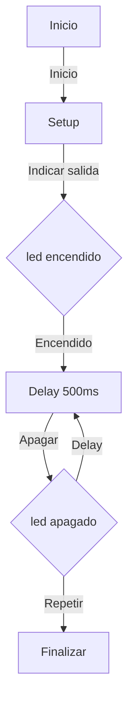
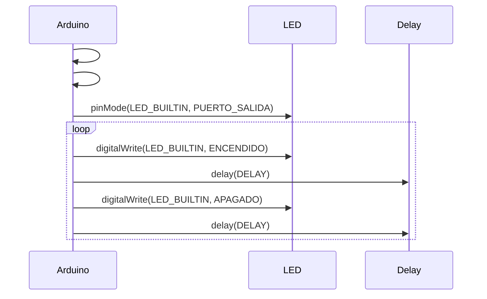

## **Practica 1: BLINK**

En esta primera practica tendremos que producir un parpadeo en el LED a a partir del microprocesador ESP32-S3.

## **1. Codigo Básico:**

**Codigo main.cpp:**
```
#define LED_BUILTIN 2
#define DELAY 500

void setup() {
 pinMode(LED_BUILTIN, OUTPUT);
}
void loop() {
 digitalWrite(LED_BUILTIN, HIGH);
 delay(DELAY);
 digitalWrite(LED_BUILTIN, LOW);
 delay(DELAY);
}
```

## **2. Modificar el programa (ON, OFF):**

**Codigo main.cpp:**
```
#include <Arduino.h>

#define LED_BUILTIN 23
#define DELAY 1000 //ms


void setup() {
Serial.begin(115200); 
pinMode(LED_BUILTIN, OUTPUT);

}

void loop() {
    
digitalWrite(LED_BUILTIN, HIGH);

Serial.println("ON"); 
delay(DELAY);
digitalWrite(LED_BUILTIN, LOW);

Serial.println("OFF"); 
delay(DELAY);
}
```

En este segundo programa ses han agregado dos puertos de salida, el puerto ON  y el puerto OFF,
esto lo hemos hecho con las funciones que enunciaba la practica, las Serial.printIN. Ademas tambien se ha modificado el tiempo de espera del LED, que en el
anterior apartado era de 500 milisegundos y en este ha pasado a ser de 1000 milisegundos.


## **3. Modificar programa para que actue en los registros de entrada de salida:**

**Codigo main.cpp:**
```
#include <Arduino.h>

#define LED_BUILTIN 23
#define DELAY 1000

#define GPIO_OUT_REG 0x3FF4400C

void setup() {
  Serial.begin(115200);
  pinMode(LED_BUILTIN, OUTPUT);
}

void loop() {
  volatile uint32_t *gpio_out = (volatile uint32_t *)GPIO_OUT_REG;

  *gpio_out |= (1 << LED_BUILTIN);
  digitalWrite(LED_BUILTIN, HIGH);

  Serial.println("ON");
  
  delay(DELAY);

  *gpio_out ^= (1 << LED_BUILTIN);
  digitalWrite(LED_BUILTIN, LOW);

  Serial.println("OFF");

  delay(DELAY);
}
```

En este tercer codigo se ha cambiado para actuar en los registros de entrada y salida, 
y se ha hecho a partir de las instrucciones de la pracica de gpio_out.


## **4. Medir frecuencia máxima:**

En este l que hemos hecho es cambiar el pin de salida por otro que este libre y después con el osciloscopio medimos la frequencia máxima de apagado y encendido. Estas frequencias las tomaremos en cuatro casos diferentes: 
· Con el envio por el puerto série del mensaje i utilizando las funciones de Arduino
· Con el envio por el puerto série y accedirendo directamente a los registros
· Sin el envio por el puerto série del mensaje i utilizando las funciones de Arduino
· Sin el envio por el puerto série y accedirendo directamente a los registros

### **4.1 Con el envio por puerto série del mensaje y utilizando las funciones del Arduino:**

**Codigo main.cpp:**
```
 #include <Arduino.h>

   int led = 14; 

   void setup() {                
      pinMode(led, OUTPUT);   
      Serial.begin(115200);
   }

   void loop() {
      Serial.println("ON");
      digitalWrite(led, HIGH);
      Serial.println("OFF");      
      digitalWrite(led, LOW);
   }
```

Ponemos como salida el **pin 14**, y en este caso como frquencia del osciloscopio tenemos ***29.81 Khz**.


### **4.2 - Con el envio por puerto série y accediendo directamente a los registros:**

**Codigo main.cpp:**
```
 #include <Arduino.h>

   int led = 14;
   uint32_t *gpio_out = (uint32_t *)GPIO_OUT_REG;

   void setup() {                
      pinMode(led, OUTPUT);   
      Serial.begin(115200);
   }

   void loop() {
      Serial.println("ON");
      *gpio_out |= (1 << led);
      Serial.println("OFF");      
      *gpio_out ^= (1 << led);
   }
```
Aqui tenemos como pin de salida el pin **14**, y la frquencia que obtenemos del osciloscopio es de ***29.77 Khz**.


### **4.3 - Sin el envio por el puerto série del mensaje i utilizando las funciones de Arduino:**

**Codigo main.cpp:**
```
#include <Arduino.h>
int led = 14; 

void setup() {                
   pinMode(led, OUTPUT);   
}

void loop() {
   digitalWrite(led, HIGH);
   digitalWrite(led, LOW);
}
```

En este caso la frequencia registrada del osciloscopio es de **1.72 Mhz**.

### **4.4 - Sin el envio por el puerto série y accedirendo directamente a los registros:**

**Codigo main.cpp:**
```
#include <Arduino.h>

int led = 14; 
uint32_t *gpio_out = (uint32_t *)GPIO_OUT_REG;

void setup() {                
   pinMode(led, OUTPUT);   
}

void loop() {
   *gpio_out |= (1 << led);
   *gpio_out ^= (1 << led);
}
```

Y en este último caso la frecuencia del osciloscopio es de **4.701 Mhz**.


## **5. Diagrama de flujo i diagrama de tiempo:**


### **5.1 - Diagrama de flujo:**



En este diagrama de flujo vemos que primero se inicia y se especifica la salida, después al encenderse el led pasa el tiempo del delay y se apaga, y una vez que ya se ha apagado vuelve a pasar el mismo tiempo de delay y el led se vuelve a encender.


### **5.2- Diagrama de tiempo:**




## **6. Tiempo libre del procesador:**


