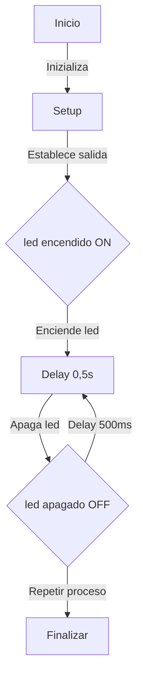
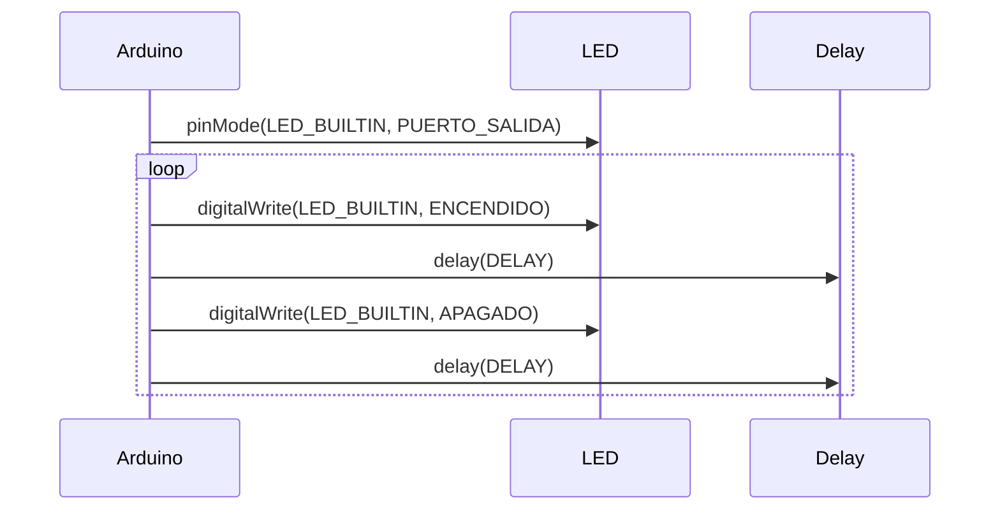

## **Practica 1: BLINK**

En esta primera practica tendremos que producir un parpadeo en el LED a a partir del microprocesador ESP32-S3.

## **1. Codigo Básico:**

**Codigo main.cpp:**
```
#include <Arduino.h>
#define LED_BUILTIN 48
#define DELAY 500


 void setup() {
  pinMode(LED_BUILTIN, OUTPUT);
  }
  void loop() {
  digitalWrite(LED_BUILTIN, HIGH);
  delay(DELAY);
  digitalWrite(LED_BUILTIN, LOW);
  delay(DELAY);
  }

```

## **2. Modificar el programa (ON, OFF):**

**Codigo main.cpp:**
```
#include <Arduino.h>
#define LED_BUILTIN 48  // Pin del LED
#define DELAY 1000      // Tiempo de espera en milisegundos


void setup() {
    pinMode(LED_BUILTIN, OUTPUT);  // Configurar LED como salida
    Serial.begin(115200);          // Inicializar comunicación serie
}


void loop() {
    digitalWrite(LED_BUILTIN, HIGH);  // Encender LED
    Serial.println("ON");             // Enviar mensaje por serie
    delay(DELAY);                    


    digitalWrite(LED_BUILTIN, LOW);   // Apagar LED
    Serial.println("OFF");            // Enviar mensaje por serie
    delay(DELAY);                    
}
```

En este segundo programa ses han agregado dos puertos de salida, el puerto ON  y el puerto OFF,
esto lo hemos hecho con las funciones que enunciaba la practica, las Serial.printIN. Ademas tambien se ha modificado el tiempo de espera del LED, que en el
anterior apartado era de 500 milisegundos y en este ha pasado a ser de 1000 milisegundos.


## **3. Modificar programa para que actue en los registros de entrada de salida:**

**Codigo main.cpp:**
```
#include <Arduino.h>
#define LED_PIN 48
#define DELAY 1000


void setup() {
    // Configurar el pin como salida directamente en el hardware
    gpio_pad_select_gpio(LED_PIN);
    gpio_set_direction((gpio_num_t)LED_PIN, GPIO_MODE_OUTPUT);


    // Inicializar el puerto serie
    Serial.begin(115200);
}


void loop() {
    uint32_t *gpio_out = (uint32_t *)GPIO_OUT_REG; // Puntero al registro GPIO


    *gpio_out |= (1 << LED_PIN);  // Encender LED
    Serial.println("ON");         // Mensaje serie
    delay(DELAY);


    *gpio_out &= ~(1 << LED_PIN); // Apagar LED
    Serial.println("OFF");        // Mensaje serie
    delay(DELAY);
}

```

En este tercer codigo se ha cambiado para actuar en los registros de entrada y salida, 
y se ha hecho a partir de las instrucciones de la pracica de gpio_out.


## **4. Medir frecuencia máxima:**

En este l que hemos hecho es cambiar el pin de salida por otro que este libre y después con el osciloscopio medimos la frequencia máxima de apagado y encendido. Estas frequencias las tomaremos en cuatro casos diferentes: 
· Con el envio por el puerto série del mensaje i utilizando las funciones de Arduino
· Con el envio por el puerto série y accedirendo directamente a los registros
· Sin el envio por el puerto série del mensaje i utilizando las funciones de Arduino
· Sin el envio por el puerto série y accedirendo directamente a los registros
```
#define LED_PIN 48  // Cambia el pin según disponibilidad


void setup() {
    Serial.begin(115200); // Iniciar puerto serie
    gpio_pad_select_gpio(LED_PIN);
    gpio_set_direction((gpio_num_t)LED_PIN, GPIO_MODE_OUTPUT);
}


void loop() {
```

### **4.1 Con el envio por puerto série del mensaje y utilizando las funciones del Arduino:**

**Codigo main.cpp:**
```
 digitalWrite(LED_PIN, HIGH);
 Serial.println("ON");
 digitalWrite(LED_PIN, LOW);
 Serial.println("OFF");

```

Ponemos como salida el **pin 48**, y en este caso como frquencia del osciloscopio tenemos **30 kHz**.


### **4.2 - Con el envio por puerto série y accediendo directamente a los registros:**

**Codigo main.cpp:**
```
  uint32_t *gpio_out = (uint32_t *)GPIO_OUT_REG;
  *gpio_out |= (1 << LED_PIN);
   Serial.println("ON");
   *gpio_out &= ~(1 << LED_PIN);
   Serial.println("OFF");

```
Aqui tenemos como pin de salida el **pin 48**, y la frquencia que obtenemos del osciloscopio es de **30 kHz**.


### **4.3 - Sin el envio por el puerto série del mensaje i utilizando las funciones de Arduino:**

**Codigo main.cpp:**
```
digitalWrite(LED_PIN, HIGH);
digitalWrite(LED_PIN, LOW);

```

En este caso la frequencia registrada del osciloscopio es de **1.7 MHz**.

### **4.4 - Sin el envio por el puerto série y accedirendo directamente a los registros:**

**Codigo main.cpp:**
```
 uint32_t *gpio_out = (uint32_t *)GPIO_OUT_REG;
 *gpio_out |= (1 << LED_PIN);
 *gpio_out &= ~(1 << LED_PIN);

```

Y en este último caso la frecuencia del osciloscopio es de **4.7 MHz**.


## **5. Diagrama de flujo i diagrama de tiempo:**


### **5.1 - Diagrama de flujo:**



En este diagrama de flujo vemos que primero se inicia y se especifica la salida, después al encenderse el led pasa el tiempo del delay y se apaga, y una vez que ya se ha apagado vuelve a pasar el mismo tiempo de delay y el led se vuelve a encender.


### **5.2- Diagrama de tiempo:**




## **6. Tiempo libre del procesador:**

Podriamos definir el tiempo libre del procesador con la siguiente formula.

Tiempo libre del procesador = tiempo total de un ciclo -  tiempo ocupado en la ejecución del bucle


